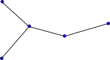
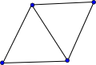
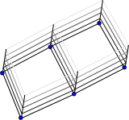
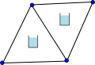
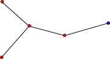
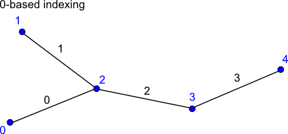

ugrid-conventions
=================

Unstructured Grid Metadata Conventions for Scientific Datasets


**Latest updates**:
* Feb 28, 2013: use topology_dimension attribute rather than dimension, as suggested by Jonathan Gregory [here](http://www.met.rdg.ac.uk/~jonathan/CF_metadata/ugrid_gridspec.html).
* Sep 12, 2012: closed clockwise discussion, explained meaning of Optionally required attributes.
* Nov 1, 2011: The section of creating mosaics of meshes has been moved to this [child page](https://publicwiki.deltares.nl/display/NETCDF/Mosaics+of+meshes). Since experience with unstructured grid mosaics is still limited, and demand is low, the mosaics are not yet part of the current proposal.

## Introduction

This page describes a proposal for storing unstructured (or flexible mesh) model data in a netCDF file. Our focus is on data for environmental applications and hence we start from the [CF-conventions](http://cf-pcmdi.llnl.gov/documents/cf-conventions) which has been the standard in climate research for many years, and is increasingly adopted by others as the metadata standard for netCDF, see e.g. [NASA Standards Process Group](http://www.esdswg.org/spg/rfc/esds-rfc-021) and [OGC](http://www.opengeospatial.org/standards/netcdf). The CF conventions allow you to define values at points, and the associated coordinates may have `bounds` attributes to indicate a spatial extent bigger than a single point. A two-dimensional array of points, encodes a structured topology but the CF conventions do not yet provide the means to define an unstructured topology. That's what this proposal adds.

In its most basic form unstructured data may be stored as data defined at a series of points, the CF-conventions are then sufficient. However, it is often useful or even necessary to also know the topology of the underlying unstructured mesh: is it a 1D network, a 2D triangular mesh or more flexible mixed triangle/quadrilateral mesh, a 2D mesh with vertical layers, or a fully unstructured 3D mesh. This document describes the attribute conventions for storing the mesh topology and for associating variables with (specific locations on) the mesh topology. The conventions have been designed to store the output data of a combined 1D-2D-3D flow model with staggered data, but the metadata for a simple 1D network or 2D triangular mesh doesn't suffer from the genericity needed for the most complex models.

Due to the wide variety in unstructured mesh models, some relevant concepts have not yet been worked out in detail. This includes the following concepts:
* adaptive mesh topology (this could be supported by defining a `time_concatenation` attribute for a time-series of mesh topologies)
* higher order element data; for an idea how such data could be stored see this other [proposal](https://publicwiki.deltares.nl/display/NETCDF/Finite+Element+based+CF+proposal+for+Unstructured+Grid+data+model).
* subgrid data; the netCDF pages by the BAW contain some proposals on this topic ([see their pages (in German)](http://www.baw.de/methoden/index.php5/NetCDF)).
* 3D fully unstructured meshes (included but still limited in scope).
See also a related [proposal](https://svn.pnl.gov/gcrm/wiki/DataModelProposal) for an unstructured mesh data model by Jeff Daily at PNNL.


## Topology

### Naming conventions for geometrical elements

Inspired by Wikipedia's definition of [network topology](http://en.wikipedia.org/wiki/Network_topology), we define the mesh topology here as the interconnection of various geometrical elements of the mesh. The pure interconnectivity is independent of georeferencing the individual geometrical elements, but for the practical applications for which we are defining this CF extension, we'll always add coordinate data. Within a mesh, one can distinguish 0-, 1-, 2- and 3-dimensional elements. We need some names to identify these four types of elements; after discussion we propose the following names:

| Dimensionality | Proposed Name | Comments |
| --- | --- | --- |
| 0 | node | A point, a coordinate pair or triplet: the most basic element of the topology. The word node seems to be more commonly used than the alternative "vertex". |
| 1 | edge | A line or curve bounded by two nodes. |
| 2 | face | A plane or surface enclosed by a set of edges. In a 2D horizontal application one may consider the word "polygon", but in the hierarchy of elements the word face is most common. |
| 3 | volume | A volume enclosed by a set of faces. |

_In favor of simpler code for interpreting compliant files, we have dropped to use of the `locations` attribute which allowed the user to specify his/her own names for nodes, edges, faces and volumes._

### 1D network topology

The topology information is stored as attributes to a dummy variable (in the example below called "Mesh1") with `cf_role` mesh_topology.

| Required topology attributes | Value |
| --- | --- |
| cf_role | mesh_topology |
| topology_dimension | 1 |
| node_coordinates |
| edge_node_connectivity |
| **Optional attributes** |
| edge_coordinates |

The attribute `topology_dimension` indicates the highest dimensionality of the geometric elements; for a 1D network this should be 1. The attribute `node_coordinates` points to the auxiliary coordinate variables representing the node locations (latitude, longitude, and optional elevation or other coordinates). These auxiliary coordinate variables will have length nNodes. The attribute `edge_node_connectivity` points to an index variable identifying for every edge to the indices of its begin and end nodes. The connectivity array will thus be a matrix of size nEdges x 2. For the indexing one may use either 0- or 1-based indexing; the convention used should be specified using a `start_index` attribute to the index variable (i.e. Mesh1_edge_nodes in the example below). Consistent with the CF-conventions [compression](http://cf-pcmdi.llnl.gov/documents/cf-conventions/1.4/cf-conventions.html#compression-by-gathering) option, the connectivity indices are 0-based by default.

_The option to support both 0- and 1-based indexing was introduced to be able to support existing files with 1-based index tables using ncML._ See [this section on 0-/1-based indexing|#0/1basedindexing] for more details. 

The mesh_topology may optionally include an `edge_coordinates` attribute which points to the auxiliary coordinate variables associated with the characteristic location of the edge (commonly the midpoint). These auxiliary coordinate variables will have length nEdges, and may have in turn a `bounds` attribute that specifies the bounding coordinates of the edge (thereby duplicating the data in the `node_coordinates` variables).

_This use of the `bounds` attribute is consistent with the CF-convention on the use of `bounds` for multi-dimensional coordinate variables with p-sided cells, but it may not strictly be supported by the CF-convention right now._



Example:
```javascript
dimensions:
nMesh1_node = 5 ; // nNodes
nMesh1_edge = 4 ; // nEdges

Two = 2;

variables:
// Mesh topology
integer Mesh1 ;
Mesh1:cf_role = "mesh_topology" ;
Mesh1:long_name = "Topology data of 1D network" ;
Mesh1:topology_dimension = 1 ;
Mesh1:node_coordinates = "Mesh1_node_x Mesh1_node_y" ;
Mesh1:edge_node_connectivity = "Mesh1_edge_nodes" ;
Mesh1:edge_coordinates = "Mesh1_edge_x Mesh1_edge_y" ; // optional attribute
integer Mesh1_edge_nodes(nMesh1_edge, Two) ;
Mesh1_edge_nodes:cf_role = "edge_node_connectivity" ;
Mesh1_edge_nodes:long_name = "Maps every edge/link to the two nodes that it connects." ;
Mesh1_edge_nodes:start_index = 1 ;

// Mesh node coordinates
double Mesh1_node_x(nMesh1_node) ;
Mesh1_node_x:standard_name = "longitude" ;
Mesh1_node_x:long_name = "Longitude of 1D network nodes." ;
Mesh1_node_x:units = "degrees_east" ;
double Mesh1_node_y(nMesh1_node) ;
Mesh1_node_y:standard_name = "latitude" ;
Mesh1_node_y:long_name = "Latitude of 1D network nodes." ;
Mesh1_node_y:units = "degrees_north" ;

// Optional mesh edge coordinate variables
double Mesh1_edge_x(nMesh1_edge) ;
Mesh1_edge_x:standard_name = "longitude" ;
Mesh1_edge_x:long_name = "Characteristic longitude of 1D network edge (e.g. midpoint of the edge)." ;
Mesh1_edge_x:units = "degrees_east" ;
Mesh1_edge_x:bounds = "Mesh1_edge_xbnds" ;
double Mesh1_edge_y(nMesh1_edge) ;
Mesh1_edge_y:standard_name = "latitude" ;
Mesh1_edge_y:long_name = "Characteristic latitude of 1D network edge (e.g. midpoint of the edge)." ;
Mesh1_edge_y:units = "degrees_north" ;
Mesh1_edge_y:bounds = "Mesh1_edge_ybnds" ;
double Mesh1_edge_xbnds(nMesh1_edge,Two) ;
Mesh1_edge_xbnds:standard_name = "longitude" ;
Mesh1_edge_xbnds:long_name = "Longitude bounds of 1D network edge (i.e. begin and end longitude)." ;
Mesh1_edge_xbnds:units = "degrees_east" ;
double Mesh1_edge_ybnds(nMesh1_edge,Two) ;
Mesh1_edge_ybnds:standard_name = "latitude" ;
Mesh1_edge_ybnds:long_name = "Latitude bounds of 1D network edge (i.e. begin and end latitude)." ;
Mesh1_edge_ybnds:units = "degrees_north" ;
```

### 2D triangular mesh topology

The topology information is stored as attributes to a dummy variable (in the example below called "Mesh2") with `cf_role` mesh_topology.

| Required topology attributes | Value |
| --- | --- |
| cf_role | mesh_topology |
| topology_dimension | 2 |
| node_coordinates |
| face_node_connectivity |
| **Optionally required attributes*** |
| edge_node_connectivity |
| **Optional attributes **|
| face_edge_connectivity |
| face_face_connectivity |
| face_coordinates |
| edge_coordinates |

*The "Optionally required" attribute `edge_node_connectivity` is required only if you want to store data on the edges (i.e. if you mind the numbering order of the edges).

The attribute `topology_dimension` indicates the highest dimensionality of the geometric elements; for a 2-dimensional (triangular) mesh this should be 2. The attribute `node_coordinates` points to the auxiliary coordinate variables representing the node locations (latitude, longitude, and optional elevation or other coordinates). These auxiliary coordinate variables will have length nNodes. The attribute `face_node_connectivity` points to an index variable identifying for every face (here consistently triangle) the indices of its three corner nodes. The corner nodes should be specified in anticlockwise (also referred to as counterclockwise) direction as viewed from above (consistent with the CF-convention for `bounds` of p-sided cells. The connectivity array will thus be a matrix of size nFaces x 3. For the indexing one may use either 0- or 1-based indexing; the convention used should be specified using a `start_index` attribute to the index variable (i.e. Mesh2_face_nodes in the example below). Consistent with the CF-conventions [compression](http://cf-pcmdi.llnl.gov/documents/cf-conventions/1.4/cf-conventions.html#compression-by-gathering] option, the connectivity indices are 0-based by default. See [this section on 0-/1-based indexing|#0/1basedindexing] for more details.

In case you want to define variables on the edges of the triangular mesh topology you need to specify the `edge_node_connectivity` attribute to map edges to nodes. Although the face to node mapping implicitly also defines the location of the edges, it does not specify the global numbering of the edges. Again the indexing convention of `edge_node_connectivity` should be specified using the `start_index` attribute to the index variable (i.e. Mesh2_edge_nodes in the example below) and 0-based indexing is the default.

Optionally the topology may have the following attributes:
* `face_edge_connectivity` pointing to an index variable identifying for every face (here consistently triangle) the indices of its three edges. The edges should be specified in anticlockwise direction as viewed from above. This connectivity array will thus be a matrix of size nFaces x 3. Again the indexing convention of `face_edge_connectivity` should be specified using the `start_index` attribute to the index variable (i.e. Mesh2_face_edges in the example below) and 0-based indexing is the default.
* `face_face_connectivity` pointing to an index variable identifying pairs of faces (here consistently triangle) that share an edge, i.e. are neighbors. _TODO: CHECK DEFINITION_ This connectivity array will thus be a matrix of size nFacePairs x 2. Again the indexing convention of `face_face_connectivity` should be specified using the `start_index` attribute to the index variable (i.e. Mesh2_face_links in the example below) and 0-based indexing is the default.
* `face_coordinates` and/or `edge_coordinates` pointing to the auxiliary coordinate variables associated with the characteristic location of the faces and edges. These auxiliary coordinate variables will have length nFaces and nEdges respectively, and may have in turn a `bounds` attribute that specifies the bounding coordinates of the face or edge (thereby duplicating the data in the `node_coordinates` variables).



Example:
```javascript
dimensions:
nMesh2_node = 4 ; // nNodes
nMesh2_edge = 5 ; // nEdges
nMesh2_face = 2 ; // nFaces
nMesh2_face_links = 1 ; // nFacePairs

Two = 2 ;
Three = 3 ;

variables:
// Mesh topology
integer Mesh2 ;
Mesh2:cf_role = "mesh_topology" ;
Mesh2:long_name = "Topology data of 2D unstructured mesh" ;
Mesh2:topology_dimension = 2 ;
Mesh2:node_coordinates = "Mesh2_node_x Mesh2_node_y" ;
Mesh2:face_node_connectivity = "Mesh2_face_nodes" ;
Mesh2:edge_node_connectivity = "Mesh2_edge_nodes" ; // attribute required if variables will be defined on edges
Mesh2:edge_coordinates = "Mesh2_edge_x Mesh2_edge_y" ; // optional attribute (requires edge_node_connectivity)
Mesh2:face_coordinates = "Mesh2_face_x Mesh2_face_y" ; // optional attribute
Mesh2:face_edge_connectivity = "Mesh2_face_edges" ; // optional attribute (requires edge_node_connectivity)
Mesh2:face_face_connectivity = "Mesh2_face_links" ; // optional attribute
integer Mesh2_face_nodes(nMesh2_face, Three) ;
Mesh2_face_nodes:cf_role = "face_node_connectivity" ;
Mesh2_face_nodes:long_name = "Maps every triangular face to its three corner nodes." ;
Mesh2_face_nodes:start_index = 1 ;
integer Mesh2_edge_nodes(nMesh2_edge, Two) ;
Mesh2_edge_nodes:cf_role = "edge_node_connectivity" ;
Mesh2_edge_nodes:long_name = "Maps every edge to the two nodes that it connects." ;
Mesh2_edge_nodes:start_index = 1 ;

// Optional mesh topology variables
integer Mesh2_face_edges(nMesh2_face, Three) ;
Mesh2_face_edges:cf_role = "face_edge_connectivity" ;
Mesh2_face_edges:long_name = "Maps every triangular face to its three edges." ;
Mesh2_face_edges:start_index = 1 ;
integer Mesh2_face_links(nMesh2_face_links, Two) ;
Mesh2_face_links:cf_role = "face_face_connectivity" ;
Mesh2_face_links:long_name = "Indicates pairs of (triangular) faces that share an edge." ;
Mesh2_face_nodes:start_index = 1 ;

// Mesh node coordinates
double Mesh2_node_x(nMesh2_node) ;
Mesh2_node_x:standard_name = "longitude" ;
Mesh2_node_x:long_name = "Longitude of 2D mesh nodes." ;
Mesh2_node_x:units = "degrees_east" ;
double Mesh2_node_y(nMesh2_node) ;
Mesh2_node_y:standard_name = "latitude" ;
Mesh2_node_y:long_name = "Latitude of 2D mesh nodes." ;
Mesh2_node_y:units = "degrees_north" ;

// Optional mesh face and edge coordinate variables
double Mesh2_face_x(nMesh2_face) ;
Mesh2_face_x:standard_name = "longitude" ;
Mesh2_face_x:long_name = "Characteristics longitude of 2D mesh triangle (e.g. circumcenter coordinate)." ;
Mesh2_face_x:units = "degrees_east" ;
double Mesh2_face_y(nMesh2_face) ;
Mesh2_face_y:standard_name = "latitude" ;
Mesh2_face_y:long_name = "Characteristics latitude of 2D mesh triangle (e.g. circumcenter coordinate)." ;
Mesh2_face_y:units = "degrees_north" ;
double Mesh2_edge_x(nMesh2_edge) ;
Mesh2_edge_x:standard_name = "longitude" ;
Mesh2_edge_x:long_name = "Characteristic longitude of 2D mesh edge (e.g. midpoint of the edge)." ;
Mesh2_edge_x:units = "degrees_east" ;
double Mesh2_edge_y(nMesh2_edge) ;
Mesh2_edge_y:standard_name = "latitude" ;
Mesh2_edge_y:long_name = "Characteristic latitude of 2D mesh edge (e.g. midpoint of the edge)." ;
Mesh2_edge_y:units = "degrees_north" ;
```

### 2D flexible mesh (mixed triangles, quadrilaterals, etc.) topology

The case of a 2D mesh with mixed face sizes is identical to the 2D triangular mesh discussed above with the exception that not all faces have the same number of nodes. To support this variability we may use in the future a ragged array, but here we propose to use _FillValue to indicate faces with smaller number of nodes than the arrays allow.

The topology information is stored as attributes to a dummy variable (in the example below called "Mesh2") with `cf_role` mesh_topology.

| Required topology attributes | Value |
| --- | --- |
| cf_role | mesh_topology |
| topology_dimension | 2 |
| node_coordinates |
| face_node_connectivity |
| **Optionally required attributes*** |
| edge_node_connectivity |
| **Optional attributes** |
| face_edge_connectivity |
| face_face_connectivity |
| face_coordinates |
| edge_coordinates |

*The "Optionally required" attribute `edge_node_connectivity` is required only if you want to store data on the edges (i.e. if you mind the numbering order of the edges).

The attribute `topology_dimension` indicates the highest dimensionality of the geometric elements; for a 2-dimensional mesh this should be 2. The attribute `node_coordinates` points to the auxiliary coordinate variables representing the node locations (latitude, longitude, and optional elevation or other coordinates). These auxiliary coordinate variables will have length nNodes. The attribute `face_node_connectivity` points to an index variable identifying for every face the indices of its corner nodes. The corner nodes should be specified in anticlockwise direction as viewed from above (consistent with the CF-convention for `bounds` of p-sided cells. The connectivity array will be a matrix of size nFaces x MaxNumNodesPerFace; if a face has less corner nodes than MaxNumNodesPerFace then the last node indices shall be equal to `_FillValue` (which should obviously be larger than the number of nodes in the mesh). For the indexing one may use either 0- or 1-based indexing; the convention used should be specified using a `start_index` attribute to the index variable (i.e. Mesh2_face_nodes in the example below). Consistent with the CF-conventions [compression](http://cf-pcmdi.llnl.gov/documents/cf-conventions/1.4/cf-conventions.html#compression-by-gathering) option, the connectivity indices are 0-based by default. See [this section on 0-/1-based indexing|#0/1basedindexing] for more details.

In case you want to define variables on the edges of the 2D mesh topology you need to specify the `edge_node_connectivity` attribute to map edges to nodes. Although the face to node mapping implicitly also defines the location of the edges, it does not specify the global numbering of the edges. Again the indexing convention of `edge_node_connectivity` should be specified using the `start_index` attribute to the index variable (i.e. Mesh2_edge_nodes in the example below) and 0-based indexing is the default.

Optionally the topology may have the following attributes:
* `face_edge_connectivity` pointing to an index variable identifying for every face the indices of its edges. The edges should be specified in anticlockwise direction as viewed from above. This connectivity array will be a matrix of size nFaces x MaxNumNodesPerFace. Again, if a face has less corners/edges than MaxNumNodesPerFace then the last edge indices shall be equal to `_FillValue`, and the indexing convention of `face_edge_connectivity` should be specified using the `start_index` attribute to the index variable (i.e. Mesh2_face_edges in the example below) and 0-based indexing is the default.
* `face_face_connectivity` pointing to an index variable identifying pairs of faces that share an edge, i.e. are neighbors. _TODO: CHECK DEFINITION_ This connectivity array will thus be a matrix of size nFacePairs x 2. Again the indexing convention of `face_face_connectivity` should be specified using the `start_index` attribute to the index variable (i.e. Mesh2_face_links in the example below) and 0-based indexing is the default.
* `face_coordinates` and/or `edge_coordinates` pointing to the auxiliary coordinate variables associated with the characteristic location of the faces and edges. These auxiliary coordinate variables will have length nFaces and nEdges respectively, and may have in turn a `bounds` attribute that specifies the bounding coordinates of the face or edge (thereby duplicating the data in the `node_coordinates` variables).

_The use of `_FillValue` to indicate faces with less nodes than MaxNumNodesPerFace extends to the coordinate bounds variables; this is an extension of the current convention._


Example:
```javascript
dimensions:
nMesh2_node = 5 ; // nNodes
nMesh2_edge = 6 ; // nEdges
nMesh2_face = 2 ; // nFaces
nMesh2_face_links = 1 ; // nFacePairs
nMaxMesh2_face_nodes = 4 ; // MaxNumNodesPerFace

Two = 2 ;

variables:
// Mesh topology
integer Mesh2 ;
Mesh2:cf_role = "mesh_topology" ;
Mesh2:long_name = "Topology data of 2D unstructured mesh" ;
Mesh2:topology_dimension = 2 ;
Mesh2:node_coordinates = "Mesh2_node_x Mesh2_node_y" ;
Mesh2:face_node_connectivity = "Mesh2_face_nodes" ;
Mesh2:edge_node_connectivity = "Mesh2_edge_nodes" ; // attribute required if variables will be defined on edges
Mesh2:edge_coordinates = "Mesh2_edge_x Mesh2_edge_y" ; // optional attribute (requires edge_node_connectivity)
Mesh2:face_coordinates = "Mesh2_face_x Mesh2_face_y" ; // optional attribute
Mesh2:face_edge_connectivity = "Mesh2_face_edges" ; // optional attribute (requires edge_node_connectivity)
Mesh2:face_face_connectivity = "Mesh2_face_links" ; // optional attribute
integer Mesh2_face_nodes(nMesh2_face, nMaxMesh2_face_nodes) ;
Mesh2_face_nodes:cf_role = "face_node_connectivity" ;
Mesh2_face_nodes:long_name = "Maps every face to its corner nodes." ;
Mesh2_face_nodes:_FillValue = 999999 ;
Mesh2_face_nodes:start_index = 1 ;
integer Mesh2_edge_nodes(nMesh2_edge, Two) ;
Mesh2_edge_nodes:cf_role = "edge_node_connectivity" ;
Mesh2_edge_nodes:long_name = "Maps every edge to the two nodes that it connects." ;
Mesh2_edge_nodes:start_index = 1 ;

// Optional mesh topology variables
integer Mesh2_face_edges(nMesh2_face, nMaxMesh2_face_nodes) ;
Mesh2_face_edges:cf_role = "face_edge_connectivity" ;
Mesh2_face_edges:long_name = "Maps every face to its edges." ;
Mesh2_face_edges:_FillValue = 999999 ;
Mesh2_face_edges:start_index = 1 ;
integer Mesh2_face_links(nMesh2_face_links, Two) ;
Mesh2_face_links:cf_role = "face_face_connectivity" ;
Mesh2_face_links:long_name = "Indicates which faces are neighbors." ;
Mesh2_face_links:start_index = 1 ;

// Mesh node coordinates
double Mesh2_node_x(nMesh2_node) ;
Mesh2_node_x:standard_name = "longitude" ;
Mesh2_node_x:long_name = "Longitude of 2D mesh nodes." ;
Mesh2_node_x:units = "degrees_east" ;
double Mesh2_node_y(nMesh2_node) ;
Mesh2_node_y:standard_name = "latitude" ;
Mesh2_node_y:long_name = "Latitude of 2D mesh nodes." ;
Mesh2_node_y:units = "degrees_north" ;

// Optional mesh face and edge coordinate variables
double Mesh2_face_x(nMesh2_face) ;
Mesh2_face_x:standard_name = "longitude" ;
Mesh2_face_x:long_name = "Characteristics longitude of 2D mesh face." ;
Mesh2_face_x:units = "degrees_east" ;
Mesh2_face_x:bounds = "Mesh2_face_xbnds" ;
double Mesh2_face_y(nMesh2_face) ;
Mesh2_face_y:standard_name = "latitude" ;
Mesh2_face_y:long_name = "Characteristics latitude of 2D mesh face." ;
Mesh2_face_y:units = "degrees_north" ;
Mesh2_face_y:bounds = "Mesh2_face_ybnds" ;
double Mesh2_face_xbnds(nMesh2_face,nMaxMesh2_face_nodes) ;
Mesh2_face_xbnds:standard_name = "longitude" ;
Mesh2_face_xbnds:long_name = "Longitude bounds of 2D mesh face (i.e. corner coordinates)." ;
Mesh2_face_xbnds:units = "degrees_east" ;
Mesh2_face_xbnds:_FillValue = 9.9692099683868690E36;
double Mesh2_face_ybnds(nMesh2_face,nMaxMesh2_face_nodes) ;
Mesh2_face_ybnds:standard_name = "latitude" ;
Mesh2_face_ybnds:long_name = "Latitude bounds of 2D mesh face (i.e. corner coordinates)." ;
Mesh2_face_ybnds:units = "degrees_north" ;
Mesh2_face_ybnds:_FillValue = 9.9692099683868690E36;
double Mesh2_edge_x(nMesh2_edge) ;
Mesh2_edge_x:standard_name = "longitude" ;
Mesh2_edge_x:long_name = "Characteristic longitude of 2D mesh edge (e.g. midpoint of the edge)." ;
Mesh2_edge_x:units = "degrees_east" ;
double Mesh2_edge_y(nMesh2_edge) ;
Mesh2_edge_y:standard_name = "latitude" ;
Mesh2_edge_y:long_name = "Characteristic latitude of 2D mesh edge (e.g. midpoint of the edge)." ;
Mesh2_edge_y:units = "degrees_north" ;
// bounds variables for edges skipped
```

### 3D layered mesh topology

For a 3D layered unstructured mesh topology this proposal follows the approach of the existing CF-conventions for structured meshes: horizontal and vertical dimensions are treated separately. For the horizontal plane a 2D unstructured mesh topology is defined, which is extruded in the vertical direction by means of a [vertical coordinate](http://cf-pcmdi.llnl.gov/documents/cf-conventions/1.4/cf-conventions.html#vertical-coordinate). The example below matches the example in the previous section combined with a vertical coordinate according CF-conventions. This example introduces also the attributes `mesh` and `location` on the 2D variables "Mesh2_surface" and "Mesh2_depth". For more information about these attributes see the [data definition|#Datadefinedonunstructuredmeshes.] section below.



Example:
```javascript
dimensions:
nMesh2_node = 6 ; // nNodes
nMesh2_edge = 7 ; // nEdges
nMesh2_face = 2 ; // nFaces
nMesh2_face_links = 1 ; // nFacePairs
nMaxMesh2_face_nodes = 4 ; // MaxNumNodesPerFace
Mesh2_layers = 10 ;

Two = 2 ;

variables:
// Mesh topology
integer Mesh2 ;
Mesh2:cf_role = "mesh_topology" ;
Mesh2:long_name = "Topology data of 2D unstructured mesh" ;
Mesh2:topology_dimension = 2 ;
Mesh2:node_coordinates = "Mesh2_node_x Mesh2_node_y" ;
Mesh2:face_node_connectivity = "Mesh2_face_nodes" ;
Mesh2:edge_node_connectivity = "Mesh2_edge_nodes" ; // attribute required if variables will be defined on edges
Mesh2:edge_coordinates = "Mesh2_edge_x Mesh2_edge_y" ; // optional attribute (requires edge_node_connectivity)
Mesh2:face_coordinates = "Mesh2_face_x Mesh2_face_y" ; // optional attribute
Mesh2:face_edge_connectivity = "Mesh2_face_edges" ; // optional attribute (requires edge_node_connectivity)
Mesh2:face_face_connectivity = "Mesh2_face_links" ; // optional attribute
integer Mesh2_face_nodes(nMesh2_face, nMaxMesh2_face_nodes) ;
Mesh2_face_nodes:cf_role = "face_node_connectivity" ;
Mesh2_face_nodes:long_name = "Maps every face to its corner nodes." ;
Mesh2_face_nodes:_FillValue = 999999 ;
Mesh2_face_nodes:start_index = 1 ;
integer Mesh2_edge_nodes(nMesh2_edge, Two) ;
Mesh2_edge_nodes:cf_role = "edge_node_connectivity" ;
Mesh2_edge_nodes:long_name = "Maps every edge to the two nodes that it connects." ;
Mesh2_edge_nodes:start_index = 1 ;

// Optional mesh topology variables
integer Mesh2_face_edges(nMesh2_face, nMaxMesh2_face_nodes) ;
Mesh2_face_edges:cf_role = "face_edge_connectivity" ;
Mesh2_face_edges:long_name = "Maps every face to its edges." ;
Mesh2_face_edges:_FillValue = 999999 ;
Mesh2_face_edges:start_index = 1 ;
integer Mesh2_face_links(nMesh2_face_links, Two) ;
Mesh2_face_links:cf_role = "face_face_connectivity" ;
Mesh2_face_links:long_name = "Indicates which faces are neighbors." ;
Mesh2_face_links:start_index = 1 ;

// Mesh node coordinates
double Mesh2_node_x(nMesh2_node) ;
Mesh2_node_x:standard_name = "longitude" ;
Mesh2_node_x:long_name = "Longitude of 2D mesh nodes." ;
Mesh2_node_x:units = "degrees_east" ;
double Mesh2_node_y(nMesh2_node) ;
Mesh2_node_y:standard_name = "latitude" ;
Mesh2_node_y:long_name = "Latitude of 2D mesh nodes." ;
Mesh2_node_y:units = "degrees_north" ;

// Optional mesh face and edge coordinate variables
double Mesh2_face_x(nMesh2_face) ;
Mesh2_face_x:standard_name = "longitude" ;
Mesh2_face_x:long_name = "Characteristics longitude of 2D mesh face." ;
Mesh2_face_x:units = "degrees_east" ;
Mesh2_face_x:bounds = "Mesh2_face_xbnds" ;
double Mesh2_face_y(nMesh2_face) ;
Mesh2_face_y:standard_name = "latitude" ;
Mesh2_face_y:long_name = "Characteristics latitude of 2D mesh face." ;
Mesh2_face_y:units = "degrees_north" ;
Mesh2_face_y:bounds = "Mesh2_face_ybnds" ;
double Mesh2_face_xbnds(nMesh2_face,nMaxMesh2_face_nodes) ;
Mesh2_face_xbnds:standard_name = "longitude" ;
Mesh2_face_xbnds:long_name = "Longitude bounds of 2D mesh face (i.e. corner coordinates)." ;
Mesh2_face_xbnds:units = "degrees_east" ;
Mesh2_face_xbnds:_FillValue = 9.9692099683868690E36;
double Mesh2_face_ybnds(nMesh2_face,nMaxMesh2_face_nodes) ;
Mesh2_face_ybnds:standard_name = "latitude" ;
Mesh2_face_ybnds:long_name = "Latitude bounds of 2D mesh face (i.e. corner coordinates)." ;
Mesh2_face_ybnds:units = "degrees_north" ;
Mesh2_face_ybnds:_FillValue = 9.9692099683868690E36;
double Mesh2_edge_x(nMesh2_edge) ;
Mesh2_edge_x:standard_name = "longitude" ;
Mesh2_edge_x:long_name = "Characteristic longitude of 2D mesh edge (e.g. midpoint of the edge)." ;
Mesh2_edge_x:units = "degrees_east" ;
double Mesh2_edge_y(nMesh2_edge) ;
Mesh2_edge_y:standard_name = "latitude" ;
Mesh2_edge_y:long_name = "Characteristic latitude of 2D mesh edge (e.g. midpoint of the edge)." ;
Mesh2_edge_y:units = "degrees_north" ;
// bounds variables for edges skipped

// Vertical coordinate
double Mesh2_layers(Mesh2_layers) ;
Mesh2_layers:standard_name = "ocean_sigma_coordinate" ;
Mesh2_layers:long_name = "sigma at layer midpoints" ;
Mesh2_layers:positive = "up" ;
Mesh2_layers:formula_terms = "sigma: Mesh2_layers eta: Mesh2_surface depth: Mesh2_depth" ;
double Mesh2_depth(nMesh2_node) ;
Mesh2_depth:standard_name = "sea_floor_depth_below_geoid" ;
Mesh2_depth:units = "m" ;
Mesh2_depth:positive = "down" ;
Mesh2_depth:mesh = "Mesh2"
Mesh2_depth:location = "node" ;
Mesh2_depth:coordinates = "Mesh2_node_x Mesh2_node_y" ;
double Mesh2_surface(nMesh2_node) ;
Mesh2_surface:standard_name = "sea_surface_height_above_geoid" ;
Mesh2_surface:units = "m" ;
Mesh2_surface:mesh = "Mesh2"
Mesh2_surface:location = "face" ;
Mesh2_surface:coordinates = "Mesh2_face_x Mesh2_face_y" ;
```

### Fully 3D unstructured (i.e. non-layered) mesh topology

For a fully 3D unstructured mesh topology we extend the hierarchy of nodes, edges and faces to volumes. Contrary to layered case this type of mesh requires a fully 3D specification of the mesh; hence we not only need latitude and longitude coordinates but also some kind of elevation coordinate (_this probably requires a new standard name_).

The topology information is stored as attributes to a dummy variable (in the example below called "Mesh3D") with `cf_role` mesh_topology.

| Required topology attributes | Value |
| --- | --- |
| cf_role | mesh_topology |
| topology_dimension | 3 |
| node_coordinates |
| volume_node_connectivity |
| volume_shape_type | 
| **Optionally-required attributes*** | 
| face_node_connectivity |
| edge_node_connectivity |
| **Optional attributes** |
| volume_edge_connectivity |
| volume_face_connectivity |
| volume_volume_connectivity |
| face_edge_connectivity |
| volume_coordinates |
| face_coordinates |
| edge_coordinates |

*The "Optionally required" attributes `edge_node_connectivity` and `face_node_connectivity` are required only if you want to store data on the edges or faces respectively (i.e. if you mind the numbering order of the edges/faces).

The attribute `topology_dimension` indicates the highest dimensionality of the geometric elements; for a fully 3-dimensional unstructured mesh this should be 3. The attribute `node_coordinates` points to the auxiliary coordinate variables representing the node locations (latitude, longitude, elevation and optional other coordinates). These auxiliary coordinate variables will have length nNodes. The attribute `volume_node_connectivity` points to an index variable identifying for every volume the indices of its corner nodes. For faces in the horizontal plane, it was possible to prescribe the order of the nodes, but this is not possible for the nodes of generic 3D volumes. For this reason we introduce an additional attribute `volume_shape_type` which points to a flag variable that specifies for every volume its shape:

| flag_meaning name| description|
| --- | --- |
|tetrahedron|pyramid with triangular base, 4 nodes|
|pyramid|pyramid with square base, a pentahedron, 5 nodes|
|wedge|prism with triangular base, a pentahedron, 6 nodes|
|hexahedron|distorted cube, 8 nodes|

These four volume shapes are the ones most commonly used. More shapes can be added; and if necessary, it's possible to add a generic shape type which allows for specification of the volume shape indirectly via `volume_face_connectivity` and `face_node_connectivity` variables. Such a generic shape is not included in this proposal since there is no practical need for such feature at this time.

_If all volumes have the same shape type, then the shape typed could be determined based on the number of nodes per volume. Another option could be to allow the `volume_shape_type` to specify the shape type directly rather than pointing to a variable. However, for the time being we assume that the currently proposed volume shape type variable doesn't have too much impact on the performance._

The order in which the corner nodes of a volume are specified is fixed given its shape; this approach is common in 3D modeling, see e.g. [this graph in the OpenFOAM documentation](http://www.openfoam.com/docs/user/mesh-description.php#x23-1350072) and [PARAVIEW](http://www.vtk.org/Wiki/index.php?title=ParaView/Users_Guide/VTK_Data_Model) or [VTK](http://www.vtk.org/doc/release/5.8/html/a00294.html) documentation. The `volume_node_connectivity` array will be a matrix of size nVolumes x MaxNumNodesPerVolume; if a volume has less corner nodes than MaxNumNodesPerVolume then the last node indices shall be equal to `_FillValue` (which should obviously be larger than the number of nodes in the mesh). For the indexing one may use either 0- or 1-based indexing; the convention used should be specified using a `start_index` attribute to the index variable (i.e. Mesh3D_vol_nodes in the example below). Consistent with the CF-conventions [compression](http://cf-pcmdi.llnl.gov/documents/cf-conventions/1.4/cf-conventions.html#compression-by-gathering) option, the connectivity indices are 0-based by default. See [this section on 0-/1-based indexing|#0/1basedindexing] for more details.

In case you want to define variables on the faces or edges of the 3D mesh topology you need to specify the `face_node_connectivity` or `edge_node_connectivity` attribute, respectively, to map faces or edges to nodes. Although the volume to node mapping implicitly also defines the location of the faces and edges, it does not specify their global numbering. Again the indexing convention of `face_node_connectivity` and `edge_node_connectivity` should be specified using the `start_index` attribute to the index variable and 0-based indexing is the default.

Optionally the topology may have the following attributes:
* `volume_face_connectivity` pointing to an index variable identifying for every volume the indices of its faces. The order in which the face indices should be specified is determined by the volume geometry type. This connectivity array will be a matrix of size nVolumes x MaxNumFacesPerVolume. If a volume has less faces than MaxNumFacesPerVolume then the last face indices shall be equal to `_FillValue`, and the indexing convention of `volume_edge_connectivity` should be specified using the `start_index` attribute to the index variable and 0-based indexing is the default.
* `volume_edge_connectivity` pointing to an index variable identifying for every volume the indices of its edges. The order in which the edge indices should be specified is determined by the volume geometry type. This connectivity array will be a matrix of size nVolumes x MaxNumEdgesPerVolume. Again, if a volume has less edges than MaxNumEdgesPerVolume then the last edge indices shall be equal to `_FillValue`, and the indexing convention of `volume_edge_connectivity` should be specified using the `start_index` attribute to the index variable and 0-based indexing is the default.
* `volume_volume_connectivity` pointing to an index variable identifying pairs of volumes that share a face, i.e. are neighbors. This connectivity array will thus be a matrix of size nVolumePairs x 2. As usual the indexing convention of `volume_volume_connectivity` should be specified using the `start_index` attribute to the index variable (i.e. Mesh3D_vol_links in the example below) and 0-based indexing is the default.
* `face_edge_connectivity` pointing to an index variable identifying for every face the indices of its edges. The edges should be specified in anticlockwise direction as viewed from above. This connectivity array will be a matrix of size nFaces x MaxNumNodesPerFace. As always, if a face has less corners/edges than MaxNumNodesPerFace then the last edge indices shall be equal to `_FillValue`, and the indexing convention of `face_edge_connectivity` should be specified using the `start_index` attribute to the index variable and 0-based indexing is the default.
* `face_node_connectivity` pointing to an index variable identifying for every face the indices of its nodes. The nodes should be specified in either clockwise or anticlockwise order. This connectivity array will be a matrix of size nFaces x MaxNumNodesPerFace. Again, if a face has less corners/edges than MaxNumNodesPerFace then the last node indices shall be equal to `_FillValue`, and the indexing convention of `face_node_connectivity` should be specified using the `start_index` attribute to the index variable and 0-based indexing is the default.
* `volume_coordinates`, `face_coordinates` and/or `edge_coordinates` pointing to the auxiliary coordinate variables associated with the characteristic location of the volumes, faces and edges. These auxiliary coordinate variables will have length nVolumes, nFaces and nEdges respectively, and may have in turn a `bounds` attribute that specifies the corner coordinates of the volume, face or edge (thereby duplicating the data in the `node_coordinates` variables). The order in which the corner coordinates of the volumes is given by the volume geometry type.


Example:
```python
dimensions:
nMesh3D_node = 12 ; // nNodes
nMesh3D_edge = 23 ; // nEdges
nMesh3D_face = 16 ; // nFaces
nMesh3D_vol = 4 ; // nVolumes
nMesh3D_vol_links = 4 ; // nVolumePairs
nMaxMesh3D_face_nodes = 4 ; // MaxNumNodesPerFace
nMaxMesh3D_vol_nodes = 8 ; // MaxNumNodesPerVolume
nMaxMesh3D_vol_edges = 12 ; // MaxNumEdgesPerVolume
nMaxMesh3D_vol_faces = 6 ; // MaxNumFacesPerVolume

Two = 2 ;

variables:
// Mesh topology
integer Mesh3D ;
Mesh3D:cf_role = "mesh_topology" ;
Mesh3D:long_name = "Topology data of 3D unstructured mesh" ;
Mesh3D:topology_dimension = 3 ;
Mesh3D:node_coordinates = "Mesh3D_node_x Mesh3D_node_y Mesh3D_node_z" ;
Mesh3D:volume_shape_type = "Mesh3D_vol_types" ;
Mesh3D:volume_node_connectivity = "Mesh3D_vol_nodes" ;
Mesh3D:face_node_connectivity = "Mesh3D_face_nodes" ; // attribute required if variables will be defined on faces
Mesh3D:edge_node_connectivity = "Mesh3D_edge_nodes" ; // attribute required if variables will be defined on edges
Mesh3D:edge_coordinates = "Mesh3D_edge_x Mesh3D_edge_y Mesh3D_edge_z" ; // optional attribute (requires edge_node_connectivity)
Mesh3D:face_coordinates = "Mesh3D_face_x Mesh3D_face_y Mesh3D_face_z" ; // optional attribute (requires face_node_connectivity)
Mesh3D:volume_coordinates = "Mesh3D_vol_x Mesh3D_vol_y Mesh3D_vol_z" ; // optional attribute
Mesh3D:volume_face_connectivity = "Mesh3D_vol_faces" ; // optional attribute (requires face_node_connectivity)
Mesh3D:volume_edge_connectivity = "Mesh3D_vol_edges" ; // optional attribute (requires edge_node_connectivity)
Mesh3D:face_edge_connectivity = "Mesh3D_face_edges" ; // optional attribute (requires face_node_connectivity and edge_node_connectivity)
Mesh3D:volume_volume_connectivity = "Mesh3D_vol_links" ; // optional attribute
integer Mesh3D_vol_types(nMesh3D_vol) ;
Mesh3D_vol_types:cf_role = "volume_shape_type" ;
Mesh3D_vol_types:long_name = "Specifies the shape of the individual volumes." ;
Mesh3D_vol_types:flag_range = 0b, 2b ;
Mesh3D_vol_types:flag_values = 0b, 1b, 2b ;
Mesh3D_vol_types:flag_meanings = "tetrahedron wedge hexahedron" ;
integer Mesh3D_vol_nodes(nMesh3D_vol, nMaxMesh3D_vol_nodes) ;
Mesh3D_vol_nodes:cf_role = "volume_node_connectivity" ;
Mesh3D_vol_nodes:long_name = "Maps every volume to its corner nodes." ;
Mesh3D_vol_nodes:_FillValue = 999999 ;
Mesh3D_vol_nodes:start_index = 1 ;

// Optional mesh topology variables
integer Mesh3D_edge_nodes(nMesh3D_edge, Two) ;
Mesh3D_edge_nodes:cf_role = "edge_node_connectivity" ;
Mesh3D_edge_nodes:long_name = "Maps every edge to the two nodes that it connects." ;
Mesh3D_edge_nodes:start_index = 1 ;
integer Mesh3D_face_nodes(nMesh3D_face, nMaxMesh3D_face_nodes) ;
Mesh3D_face_nodes:cf_role = "face_node_connectivity" ;
Mesh3D_face_nodes:long_name = "Maps every face to its corner nodes." ;
Mesh3D_face_nodes:_FillValue = 999999 ;
Mesh3D_face_nodes:start_index = 1 ;
integer Mesh3D_vol_faces(nMesh3D_vol, nMaxMesh3D_vol_faces) ;
Mesh3D_vol_faces:cf_role = "volume_face_connectivity" ;
Mesh3D_vol_faces:long_name = "Maps every volume to its faces." ;
Mesh3D_vol_faces:_FillValue = 999999 ;
Mesh3D_vol_faces:start_index = 1 ;
integer Mesh3D_vol_edges(nMesh3D_vol, nMaxMesh3D_vol_edges) ;
Mesh3D_vol_edges:cf_role = "volume_edge_connectivity" ;
Mesh3D_vol_edges:long_name = "Maps every volume to its edges." ;
Mesh3D_vol_edges:_FillValue = 999999 ;
Mesh3D_vol_edges:start_index = 1 ;
integer Mesh3D_face_edges(nMesh3D_face, nMaxMesh3D_face_nodes) ;
Mesh3D_face_edges:cf_role = "face_edge_connectivity" ;
Mesh3D_face_edges:long_name = "Maps every face to its edges." ;
Mesh3D_face_edges:_FillValue = 999999 ;
Mesh3D_face_edges:start_index = 1 ;
integer Mesh3D_vol_links(nMesh3D_vol_links, Two) ;
Mesh3D_vol_links:cf_role = "volume_volume_connectivity" ;
Mesh3D_vol_links:long_name = "Indicates which volumes are neighbors." ;
Mesh3D_vol_links:start_index = 1 ;

// Mesh node coordinates
double Mesh3D_node_x(nMesh3D_node) ;
Mesh3D_node_x:standard_name = "longitude" ;
Mesh3D_node_x:long_name = "Longitude of 3D mesh nodes." ;
Mesh3D_node_x:units = "degrees_east" ;
double Mesh3D_node_y(nMesh3D_node) ;
Mesh3D_node_y:standard_name = "latitude" ;
Mesh3D_node_y:long_name = "Latitude of 3D mesh nodes." ;
Mesh3D_node_y:units = "degrees_north" ;
double Mesh3D_node_z(nMesh3D_node) ;
Mesh3D_node_z:standard_name = "elevation" ;
Mesh3D_node_z:long_name = "Elevation of 3D mesh nodes." ;
Mesh3D_node_z:units = "m" ;

// Optional mesh volume, face and edge coordinate variables
double Mesh3D_vol_x(nMesh3D_vol) ;
Mesh3D_vol_x:standard_name = "longitude" ;
Mesh3D_vol_x:long_name = "Characteristics longitude of mesh volumes." ;
Mesh3D_vol_x:units = "degrees_east" ;
Mesh3D_vol_x:bounds = "Mesh3D_vol_xbnds" ;
double Mesh3D_vol_y(nMesh3D_vol) ;
Mesh3D_vol_y:standard_name = "latitude" ;
Mesh3D_vol_y:long_name = "Characteristics latitude of mesh volumes." ;
Mesh3D_vol_y:units = "degrees_north" ;
Mesh3D_vol_y:bounds = "Mesh3D_vol_ybnds" ;
double Mesh3D_vol_z(nMesh3D_vol) ;
Mesh3D_vol_z:standard_name = "elevation" ;
Mesh3D_vol_z:long_name = "Characteristics elevation of mesh volumes." ;
Mesh3D_vol_z:units = "m" ;
Mesh3D_vol_z:bounds = "Mesh3D_vol_zbnds" ;
double Mesh3D_vol_xbnds(nMesh3D_vol,nMaxMesh3D_vol_nodes) ;
Mesh3D_vol_xbnds:standard_name = "longitude" ;
Mesh3D_vol_xbnds:long_name = "Longitude bounds of mesh volumes (i.e. corner coordinates)." ;
Mesh3D_vol_xbnds:units = "degrees_east" ;
Mesh3D_vol_xbnds:_FillValue = 9.9692099683868690E36;
double Mesh3D_vol_ybnds(nMesh3D_vol,nMaxMesh3D_vol_nodes) ;
Mesh3D_vol_ybnds:standard_name = "latitude" ;
Mesh3D_vol_ybnds:long_name = "Latitude bounds of mesh volumes (i.e. corner coordinates)." ;
Mesh3D_vol_ybnds:units = "degrees_north" ;
Mesh3D_vol_ybnds:_FillValue = 9.9692099683868690E36;
double Mesh3D_vol_zbnds(nMesh3D_vol,nMaxMesh3D_vol_nodes) ;
Mesh3D_vol_zbnds:standard_name = "elevation" ;
Mesh3D_vol_zbnds:long_name = "Elevation bounds of mesh volumes (i.e. corner coordinates)." ;
Mesh3D_vol_zbnds:units = "m" ;
Mesh3D_vol_zbnds:_FillValue = 9.9692099683868690E36;
double Mesh3D_face_x(nMesh3D_face) ;
Mesh3D_face_x:standard_name = "longitude" ;
Mesh3D_face_x:long_name = "Characteristics longitude of mesh faces." ;
Mesh3D_face_x:units = "degrees_east" ;
double Mesh3D_face_y(nMesh3D_face) ;
Mesh3D_face_y:standard_name = "latitude" ;
Mesh3D_face_y:long_name = "Characteristics latitude of mesh faces." ;
Mesh3D_face_y:units = "degrees_north" ;
double Mesh3D_face_z(nMesh3D_face) ;
Mesh3D_face_z:standard_name = "elevation" ;
Mesh3D_face_z:long_name = "Characteristics elevation of mesh faces." ;
Mesh3D_face_z:units = "m" ;
// bounds variables for faces skipped
double Mesh3D_edge_x(nMesh3D_edge) ;
Mesh3D_edge_x:standard_name = "longitude" ;
Mesh3D_edge_x:long_name = "Characteristic longitude of 2D mesh edge (e.g. midpoint of the edge)." ;
Mesh3D_edge_x:units = "degrees_east" ;
double Mesh3D_edge_y(nMesh3D_edge) ;
Mesh3D_edge_y:standard_name = "latitude" ;
Mesh3D_edge_y:long_name = "Characteristic latitude of 2D mesh edge (e.g. midpoint of the edge)." ;
Mesh3D_edge_y:units = "degrees_north" ;
double Mesh3D_edge_z(nMesh3D_edge) ;
Mesh3D_edge_z:standard_name = "latitude" ;
Mesh3D_edge_z:long_name = "Characteristic latitude of 2D mesh edge (e.g. midpoint of the edge)." ;
Mesh3D_edge_z:units = "degrees_north" ;
// bounds variables for edges skipped
```

## Data defined on unstructured meshes

According to CF-conventions a variable defined on a _structured_ mesh is specified as

```javascript
double waterlevel(time,nmax,mmax) ;
waterlevel:standard_name = "sea_surface_height_above_geoid" ;
waterlevel:units = "m" ;
waterlevel:coordinates = "lat lon" ;
```

The `coordinates` attribute refers to the variables that contain the latitude and longitude coordinates. For a curvilinear grid these variables will share two spatial dimensions, here `nmax` and `mmax`: lat(nmax,mmax) and lon(nmax,mmax). In numerical models the various quantities are often computed at different locations of the mesh: staggered data. The standard CF-conventions don't offer specific support for this functionality and thus for every stagger location coordinates need to be provided separately: cell center coordinates, corner point coordinates, u-flux point coordinates, and v-flux point coordinates. The underlying topology of the mesh, i.e. how these coordinates (variable definition locations) relate to each other isn't stored in the file. This shortcoming is to some degree solved by the [gridspec](http://www.gfdl.noaa.gov/~vb/gridstd/gridstd.html) proposal by Balaji. We introduce here attributes that link to the topological data defined above.

### Data variables

The use of the `coordinates` attribute is copied from the CF-conventions. It is used to map the values of variables defined on the unstructured meshes directly to their location: latitude, longitude and optional elevation. To map the variable onto the topology of the underlying mesh, two new attributes have been introduced. First, the attribute `mesh` points to the mesh_topology variable containing the meta-data attributes of the mesh on which the variable has been defined. Second, the attribute `location` points to the (stagger) location within the mesh at which the variable is defined. Note that in this example the `coordinates` attribute is redundant since the coordinates could also be obtained by using the `face_coordinates` attribute of the "Mesh2" variable.

```javascript
double Mesh2_waterlevel(time,nMesh2_face) ;
Mesh2_waterlevel:standard_name = "sea_surface_height_above_geoid" ;
Mesh2_waterlevel:units = "m" ;
Mesh2_waterlevel:mesh = "Mesh2"
Mesh2_waterlevel:location = "face" ;
Mesh2_waterlevel:coordinates = "Mesh2_face_x Mesh2_face_y" ;
```

### Volume and flux variables

The same mesh geometry can be used in different ways to schematize the hydrodynamic volumes and fluxes. Let's take a simple triangular mesh. From a finite volume point of view this mesh will generally be interpreted as consisting of two volumes with triangular base. However, others may use a continuous Galerkin finite element method that can be shown to be equivalent to a subdivision into four volumes. In the former case the two faces correspond to volumes and the fluxes _cross_ the edges. In the latter case the volumes are defined surrounding the four nodes and the fluxes are directed _along_ the edges. The two abbreviated ncdumps below show how the basic 2D triangular mesh definition can be extended to include this data. The coordinate variables for the volume data now include `bounds` attributes to define the surface area of the volumes. Note the subtle difference in the long names between the flux variables in the two cases; the `standard_name` attribute has to make a more formal distinction between the two cases.

 

Variant 1: Volume at faces:
```javascript
dimensions:
nMesh2_node = 4 ; // nNodes
nMesh2_edge = 5 ; // nEdges
nMesh2_face = 2 ; // nFaces
nMesh2_face_links = 1 ; // nFacePairs

Two = 2 ;
Three = 3 ;

variables:
// Mesh topology
integer Mesh2 ;
// as in 2D triangular mesh example
integer Mesh2_face_nodes(nMesh2_face, Three) ;
// as in 2D triangular mesh example
integer Mesh2_edge_nodes(nMesh2_edge, Two) ;
// as in 2D triangular mesh example

// Optional mesh topology variables
integer Mesh2_face_edges(nMesh2_face, Three) ;
// as in 2D triangular mesh example
integer Mesh2_face_links(nMesh2_face_links, Two) ;
// as in 2D triangular mesh example

// Mesh node coordinates
double Mesh2_node_x(nMesh2_node) ;
// as in 2D triangular mesh example
double Mesh2_node_y(nMesh2_node) ;
// as in 2D triangular mesh example

// Optional mesh face and edge coordinate variables
double Mesh2_face_x(nMesh2_face) ;
Mesh2_face_x:standard_name = "longitude" ;
Mesh2_face_x:long_name = "Characteristics longitude of 2D mesh triangle (e.g. circumcenter coordinate)." ;
Mesh2_face_x:units = "degrees_east" ;
Mesh2_face_x:bounds = "Mesh2_face_xbnds" ;
double Mesh2_face_y(nMesh2_face) ;
Mesh2_face_y:standard_name = "latitude" ;
Mesh2_face_y:long_name = "Characteristics latitude of 2D mesh triangle (e.g. circumcenter coordinate)." ;
Mesh2_face_y:units = "degrees_north" ;
Mesh2_face_y:bounds = "Mesh2_face_ybnds" ;
double Mesh2_face_xbnds(nMesh2_face,Three) ;
Mesh2_face_xbnds:standard_name = "longitude" ;
Mesh2_face_xbnds:long_name = "Longitude bounds of 2D mesh triangle (i.e. corner coordinates)." ;
Mesh2_face_xbnds:units = "degrees_east" ;
double Mesh2_face_ybnds(nMesh2_face,Three) ;
Mesh2_face_ybnds:standard_name = "latitude" ;
Mesh2_face_ybnds:long_name = "Latitude bounds of 2D mesh triangle (i.e. corner coordinates)." ;
Mesh2_face_ybnds:units = "degrees_north" ;
double Mesh2_edge_x(nMesh2_edge) ;
// as in 2D triangular mesh example
double Mesh2_edge_y(nMesh2_edge) ;
// as in 2D triangular mesh example

// Volume and flux data
double Mesh2_volumes(nMesh2_face) ;
Mesh2_volumes:long_name = "volumes" ;
Mesh2_volumes:units = "m3" ;
Mesh2_volumes:mesh = "Mesh2" ;
Mesh2_volumes:location = "face" ;
Mesh2_volumes:coordinates = "Mesh2_face_x Mesh2_face_y" ;
double Mesh2_fluxes(nMesh2_edge) ;
Mesh2_fluxes:long_name = "flux across edge" ;
Mesh2_fluxes:units = "m3 s-1" ;
Mesh2_fluxes:mesh = "Mesh2"
Mesh2_fluxes:location = "edge" ;
Mesh2_fluxes:coordinates = "Mesh2_edge_x Mesh2_edge_y" ;
```

Variant 2: Volume at nodes:
```javascript
dimensions:
nMesh2_node = 4 ; // nNodes
nMesh2_edge = 5 ; // nEdges
nMesh2_face = 2 ; // nFaces
nMesh2_face_links = 1 ; // nFacePairs
nMaxMesh2_bnds = 6 ;

Two = 2 ;
Three = 3 ;

variables:
// Mesh topology
integer Mesh2 ;
// as in 2D triangular mesh example
integer Mesh2_face_nodes(nMesh2_face, Three) ;
// as in 2D triangular mesh example
integer Mesh2_edge_nodes(nMesh2_edge, Two) ;
// as in 2D triangular mesh example

// Optional mesh topology variables
integer Mesh2_face_edges(nMesh2_face, Three) ;
// as in 2D triangular mesh example
integer Mesh2_face_links(nMesh2_face_links, Two) ;
// as in 2D triangular mesh example

// Mesh node coordinates
double Mesh2_node_x(nMesh2_node) ;
Mesh2_node_x:standard_name = "longitude" ;
Mesh2_node_x:long_name = "Longitude of 2D mesh nodes." ;
Mesh2_node_x:units = "degrees_east" ;
Mesh2_node_x:bounds = "Mesh2_node_xbnds" ;
double Mesh2_node_y(nMesh2_node) ;
Mesh2_node_y:standard_name = "latitude" ;
Mesh2_node_y:long_name = "Latitude of 2D mesh nodes." ;
Mesh2_node_y:units = "degrees_north" ;
Mesh2_node_y:bounds = "Mesh2_node_ybnds" ;
double Mesh2_node_xbnds(nMesh2_node, nMaxMesh2_bnds) ;
Mesh2_node_xbnds:standard_name = "longitude" ;
Mesh2_node_xbnds:long_name = "List of x-points that form outline of flow volume" ;
Mesh2_node_xbnds:units = "degrees_east" ;
Mesh2_node_xbnds:_FillValue = 9.9692099683868690E36;
double Mesh2_node_ybnds(nMesh2_node, nMaxMesh2_bnds) ;
Mesh2_node_ybnds:standard_name = "latitude" ;
Mesh2_node_ybnds:units = "degrees_north" ;
Mesh2_node_ybnds:long_name = "List of y-points that form outline of flow volume" ;
Mesh2_node_xbnds:_FillValue = 9.9692099683868690E36;

// Optional mesh face and edge coordinate variables
double Mesh2_face_x(nMesh2_face) ;
// as in 2D triangular mesh example
double Mesh2_face_y(nMesh2_face) ;
// as in 2D triangular mesh example
double Mesh2_edge_x(nMesh2_edge) ;
// as in 2D triangular mesh example
double Mesh2_edge_y(nMesh2_edge) ;
// as in 2D triangular mesh example

// Volume and flux data
double Mesh2_volumes(nMesh2_node) ;
Mesh2_volumes:long_name = "volumes" ;
Mesh2_volumes:units = "m3" ;
Mesh2_volumes:mesh = "Mesh2" ;
Mesh2_volumes:location = "node" ;
Mesh2_volumes:coordinates = "Mesh2_node_x Mesh2_node_y" ;
double Mesh2_fluxes(nMesh2_edge) ;
Mesh2_fluxes:long_name = "flux along edge" ;
Mesh2_fluxes:units = "m3 s-1" ;
Mesh2_fluxes:mesh = "Mesh2"
Mesh2_fluxes:location = "edge" ;
Mesh2_fluxes:coordinates = "Mesh2_edge_x Mesh2_edge_y" ;
```

### Location index set

Some variables may only be defined at specific locations within the mesh, e.g. only at boundary points or at special locations like weirs and gates. To save space and to improve readability, the concept of a location_index_set is introduced. It is basically identical to the [compression](http://cf-pcmdi.llnl.gov/documents/cf-conventions/1.4/cf-conventions.html#compression-by-gathering) option in the the CF-conventions except for the fact that the compression works on a (set of) orthogonal coordinate dimension(s) and the location_index_set works on a topology location.

The location index set is an integer variable that contains the indices of the locations at which a specific quantity is defined. The example below defines a location index set "Mesh1_set" as a subset of the "node"s of Mesh1 (red points). The attribute `location_index_set` of the variable "Mesh_waterlevel" points to this index set and the `coordinates` attribute points to the corresponding (subset) of latitude and longitude coordinates. The `mesh` and `location` attributes of the location_index_set variable are required; the `coordinates` attribute is optional. Note that the `coordinates` attributes on both "Mesh1_cell" and "Mesh1_waterlevel" are again redundant since the coordinates could also be obtained by using the index set "Mesh1_set" and the `node_coordinates` attribute of the "Mesh1" variable. Consistent with all other index variables defined here, the indexing convention of the location index set should be specified using the `start_index` attribute to the index variable and 0-based indexing is the default. See [this section on 0-/1-based indexing|#0/1basedindexing] for more details.

Contrary to a coordinate variable, the index set doesn't have to be monotonic. So, it can be used for creating subsets of the original locations as well as for renumbering the locations. If the `location_index_set` attribute is used on a variable, then the `mesh` and `location` attributes should not also be used on that variable.



```javascript
dimensions:
nMesh1_set = 4 ;

variables:
integer Mesh1_set(nMesh1_set) ;
Mesh1_set:cf_role = "location_index_set" ;
Mesh1_set:long_name = "Defines Mesh1_set as subset of the nodes of Mesh1." ;
Mesh1_set:mesh = "Mesh1" ;
Mesh1_set:location = "node" ;
Mesh1_set:start_index = 1 ;
Mesh1_set:coordinates = "Mesh1_set_x Mesh1_set_y" ;
double Mesh1_set_x(nMesh1_set) ;
Mesh1_set_x:standard_name = "longitude" ;
Mesh1_set_x:long_name = "Characteristic longitude of set (e.g. longitude of node)." ;
Mesh1_set_x:units = "degrees_east" ;
double Mesh1_set_y(nMesh1_set) ;
Mesh1_set_y:standard_name = "latitude" ;
Mesh1_set_y:long_name = "Characteristic latitude of set (e.g. latitude of node)" ;
Mesh1_set_y:units = "degrees_north" ;

double Mesh1_waterlevel(time, nMesh1_set) ;
Mesh1_waterlevel:standard_name = "sea_surface_height_above_geoid" ;
Mesh1_waterlevel:units = "m" ;
Mesh1_waterlevel:location_index_set = "Mesh1_set" ;
Mesh1_waterlevel:coordinates = "Mesh1_set_x Mesh1_set_y" ;
```


## Zero or One-based indexing
The indexing using by the CF [compression](http://cf-pcmdi.llnl.gov/documents/cf-conventions/1.4/cf-conventions.html#compression-by-gathering) option is 0-based. Therefore, it is most consistent for this CF extension for unstructured data to also use 0-based indexing, which means that points, edges, faces and volumes will be numbered starting with 0. This convention is consistent with languages like C and Java, but unlike FORTRAN and MATLAB. Since many of the unstructured models have been programed in FORTRAN and legacy netCDF files exist that use 1-based indexing (which could be upgraded to be consistent with this new proposal using ncML if 1-based indexing were allowed), we propose to support both 0- and 1-based indexing by means of the `start_index` attribute. You will find below two examples of the same network geometry using either 0- or 1-based indexing. Switching between 0- and 1-based indexing is as easy as adding 1 to or subtracting 1 from the indices upon reading or writing depending on the setting of `start_index`; allowing both options should only have a minor impact on the reading routines and no effect at all on the rest of your code.

Example of 0-based indexing:



```javascript
dimensions:
nMesh1_node = 5 ; // nNodes
nMesh1_edge = 4 ; // nEdges

Two = 2;

variables:
// Mesh topology
integer Mesh1 ;
Mesh1:cf_role = "mesh_topology" ;
Mesh1:long_name = "Topology data of 1D network" ;
Mesh1:topology_dimension = 1 ;
Mesh1:node_coordinates = "Mesh1_node_x Mesh1_node_y" ;
Mesh1:edge_node_connectivity = "Mesh1_edge_nodes" ;
Mesh1:edge_coordinates = "Mesh1_edge_x Mesh1_edge_y" ; // optional attribute
integer Mesh1_edge_nodes(nMesh1_edge, Two) ;
Mesh1_edge_nodes:cf_role = "edge_node_connectivity" ;
Mesh1_edge_nodes:long_name = "Maps every edge/link to the two nodes that it connects." ;
Mesh1_edge_nodes:start_index = 0 ; // default setting, attribute could have been skipped.

// Coordinate variables skipped

data:

Mesh1 = 0 ; // dummy

Mesh1_edge_nodes =
0, 2,
1, 2,
2, 3,
3, 4 ;
```

Example of 1-based indexing:


```javascript
dimensions:
nMesh1_node = 5 ; // nNodes
nMesh1_edge = 4 ; // nEdges

Two = 2;

variables:
// Mesh topology
integer Mesh1 ;
Mesh1:cf_role = "mesh_topology" ;
Mesh1:long_name = "Topology data of 1D network" ;
Mesh1:topology_dimension = 1 ;
Mesh1:node_coordinates = "Mesh1_node_x Mesh1_node_y" ;
Mesh1:edge_node_connectivity = "Mesh1_edge_nodes" ;
Mesh1:edge_coordinates = "Mesh1_edge_x Mesh1_edge_y" ; // optional attribute
integer Mesh1_edge_nodes(nMesh1_edge, Two) ;
Mesh1_edge_nodes:cf_role = "edge_node_connectivity" ;
Mesh1_edge_nodes:long_name = "Maps every edge/link to the two nodes that it connects." ;
Mesh1_edge_nodes:start_index = 1 ;

// Coordinate variables skipped

data:

Mesh1 = 0 ; // dummy

Mesh1_edge_nodes =
1, 3,
2, 3,
3, 4,
4, 5 ;
```


