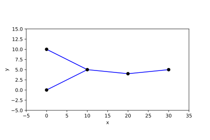
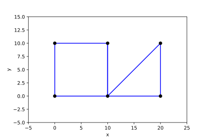
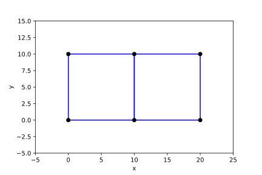

# Python examples

[](TOC)

- [Python examples](#Python-examples)
    - [Introduction](#introduction)
    - [1D mesh topology](##1D-mesh-topology)
    - [2D mesh topology](##2D-mesh-topology)
    - [3D layered mesh topology](##3D-layered-mesh-topology)

[](TOC)

## Introduction

The examples here demonstrate writing UGRID netCDF files using three Python packages. The `netcdf4` package is required to be installed for all examples, while both `gridded` and `xarray` build on top of the `netcdf4` package to provide more convenient ways of interacting with netCDF files. The examples below show how to store 1D, 2D, and 3D layered meshes with each package. 

* [netcdf4-python](https://unidata.github.io/netcdf4-python/netCDF4/index.html) is a Python interface to the netCDF C library.
* The [gridded](https://noaa-orr-erd.github.io/gridded/index.html) package seeks to present a single way to work with structured, unstructured, and staggered grids.
* [xarray](https://xarray.pydata.org/en/stable) is a Python package for working with labelled multi-dimensional arrays. Its data model closely resembles the netCDF data model: an xarray Dataset is analogous to a netCDF file.

## 1D mesh topology

This examples demonstrates a mesh of five nodes, connected by line elements:



### netCDF4

```python
import numpy as np
import netCDF4


ds = netCDF4.Dataset("netcdf4-ugrid-mesh1d.nc", "w")
# Create dimensions
node_dim = ds.createDimension("node", 5)
edge_dim = ds.createDimension("edge", 4)
connectivity_dim = ds.createDimension("nmax_edge", 2)
# Create dummy variable to store topology information
mesh1d = ds.createVariable("mesh1d", "i4")
mesh1d[:] = 0
mesh1d.cf_role= "mesh_topology"
mesh1d.long_name= "Topology data of 1D mesh"
mesh1d.topology_dimension= 1
mesh1d.node_coordinates= "node_x node_y"
mesh1d.edge_node_connectivity= "edge_nodes"
# Create coordinates of nodes
node_x = ds.createVariable("node_x", "f8", ("node",), fill_value=float("nan"))
node_y = ds.createVariable("node_y", "f8", ("node",), fill_value=float("nan"))
node_x[:] = np.array([0.0, 0.0, 10.0, 20.0, 30.0])
node_y[:] = np.array([0.0, 10.0, 5.0, 4.0, 5.0])
# Create coordinates of edges
edge_x = ds.createVariable("edge_x", "f8", ("edge",), fill_value=float("nan"))
edge_y = ds.createVariable("edge_y", "f8", ("edge",), fill_value=float("nan"))
edge_x[:] = np.array([5.0, 5.0, 15.0, 25.0])
edge_y[:] = np.array([2.5, 7.5, 4.5, 4.5])
# Create variable describing connections between nodes
edge_nodes = ds.createVariable("edge_nodes", "i8", ("edge", "nmax_edge"))
edge_nodes[:] = np.array([
    [0, 2],
    [1, 2],
    [2, 3],
    [3, 4],
])
edge_nodes.cf_role = "edge_node_connectivity"
edge_nodes.long_name = "Start and end nodes of mesh edges"
edge_nodes.start_index = 0
edge_nodes.coordinates = "edge_x edge_y"
# Set some data on the nodes
data_on_nodes = ds.createVariable(
    "data_on_nodes", "f8", ("node",), fill_value=float("nan")
)
data_on_nodes[:] = np.array([1.0, 2.0, 3.0, 4.0, 5.0])
data_on_nodes.mesh = "mesh1d"
data_on_nodes.coordinates = "node_x node_y"
# Wrap up
ds.Conventions = "CF-1.8 UGRID-1.0"
ds.close()
```

### gridded

**TODO:Not sure these 1D meshes are supported?**

```python
import numpy as np
import gridded


grid = gridded.grids.Grid_U(
    mesh_name="mesh1d",
    nodes = np.array([
        [0.0, 0.0],
        [0.0, 10.0],
        [10.0, 5.0],
        [20.0, 4.0],
        [30.0, 5.0],
    ]),
    edges = np.array([
        [0, 2],
        [1, 2],
        [2, 3],
        [3, 4],
    ]),
    edge_coordinates = np.array([
        [5.0, 2.5],
        [5.0, 7.5],
        [15.0, 4.5],
        [25.0, 2.5],
    ]),
)

# TODO: Need some help here

data_on_nodes_ = gridded.Variable(
    name="data_on_nodes",
    grid=grid,
    data=np.array([1.0, 2.0, 3.0, 4.0, 5.0])
)

ds = gridded.Dataset(grid=grid)
ds.save("gridded-ugrid-mesh1d.nc")
```

### xarray

```python
import numpy as np
import xarray as xr


out = xr.Dataset()
out["mesh1d"] = xr.DataArray(
    data=0,
    attrs={
     "cf_role": "mesh_topology",
     "long_name": "Topology data of 1D mesh",
     "topology_dimension": 1,
     "node_coordinates": "node_x node_y",
     "edge_node_connectivity": "edge_nodes",
    }
)
out = out.assign_coords(
    node_x=xr.DataArray(
        data=np.array([0.0, 0.0, 10.0, 20.0, 30.0]),
        dims=["node"],
    )
)
out = out.assign_coords(
    node_y=xr.DataArray(
        data=np.array([0.0, 10.0, 5.0, 4.0, 5.0]),
        dims=["node"],
    )
)
out["edge_nodes"] = xr.DataArray(
    data=np.array([
        [0, 2],
        [1, 2],
        [2, 3],
        [3, 4],
    ]),
    coords={
        "edge_x": ("edge", np.array([5.0, 5.0, 15.0, 25.0])),
        "edge_y": ("edge", np.array([2.5, 7.5, 4.5, 4.5])),
    },
    dims=("edge", "nmax_connectivity"),
    attrs={
        "cf_role": "edge_node_connectivity",
        "long_name": "Start and end nodes of mesh edges",
        "start_index": 0
    }
)
out["data_on_nodes"] = xr.DataArray(
    data=np.array([1.0, 2.0, 3.0, 4.0, 5.0]),
    dims=["node"],
    attrs={
        "mesh": "mesh1d",
    }
)
out["data_on_edges"] = xr.DataArray(
    data=np.array([1.0, 1.0, 2.0, 2.0]),
    dims=["edge"],
    attrs={
        "mesh": "mesh1d",
    }
)
out.attrs = {"Conventions": "CF-1.8 UGRID-1.0"}
out.to_netcdf("xarray-ugrid-mesh1d.nc")
```


## 2D mesh topology

This example demonstrates a mixed mesh of a quadrilateral and a triangle.



In case of non-mixed meshes, where the number of nodes per face is the same for all, the `_FillValue` can be omitted for the `face_node_connectivity` variable. 

This is the mapping for a quadrilateral and a triangle, with `-1` denoting a fill value.
```python
face_nodes = np.array([
    [0, 1, 2, 3],
    [1, 4, 5, -1],
])
```

Two quadrilaterals (non-mixed mesh, see the 3D layered example):
```python
face_nodes = np.array([
    [0, 1, 2, 3],
    [1, 4, 5, 2],
])
```

The face with the largest number of nodes determines the number of columns in the array, which must be rectangular.

### netCDF4

```python
import numpy as np
import netCDF4


ds = netCDF4.Dataset("netcdf4-ugrid-mesh2d.nc", "w")

# Create dimensions
node_dim = ds.createDimension("node", 6)
face_dim = ds.createDimension("face", 2)
edge_dim = ds.createDimension("edge", 7)
connectivity_dim = ds.createDimension("nmax_face", 4)
connectivity_dim = ds.createDimension("nmax_edge", 2)

# Create dummy variable to store topology information
mesh2d = ds.createVariable("mesh1d", "i4")
mesh2d[:] = 0
mesh2d.cf_role = "mesh_topology"
mesh2d.long_name = "Topology data of 2D mesh"
mesh2d.topology_dimension = 2
mesh2d.node_coordinates = "node_x node_y"
mesh2d.face_node_connectivity = "face_nodes"
mesh2d.edge_node_connectivity = "edge_nodes"

# Create coordinates of nodes
node_x = ds.createVariable("node_x", "f8", ("node",), fill_value=float("nan"))
node_y = ds.createVariable("node_y", "f8", ("node",), fill_value=float("nan"))
node_x[:] = np.array([0.0, 10.0, 10.0, 0.0, 20.0, 20.0])
node_y[:] = np.array([0.0, 0.0, 10.0, 10.0, 0.0, 10.0])

# Create coordinates of faces
face_x = ds.createVariable("face_x", "f8", ("face",), fill_value=float("nan"))
face_y = ds.createVariable("face_y", "f8", ("face",), fill_value=float("nan"))
face_x[:] = np.array([5.0, 15.0])
face_y[:] = np.array([5.0, 5.0])

# Create variable mapping faces to nodes
face_nodes = ds.createVariable("face_nodes", "i8", ("face", "nmax_face"), fill_value=-1)
face_nodes[:] = np.array([
    [0, 1, 2, 3],
    [1, 4, 5, -1],
])
face_nodes.cf_role = "face_node_connectivity"
face_nodes.long_name = "Vertex nodes of mesh faces (counterclockwise)"
face_nodes.start_index = 0

# Create coordinates of edges
edge_x = ds.createVariable("edge_x", "f8", ("edge",), fill_value=float("nan"))
edge_y = ds.createVariable("edge_y", "f8", ("edge",), fill_value=float("nan"))
edge_x[:] = np.array([5.0, 10.0, 5.0, 0.0, 15.0, 20.0, 15.0])
edge_y[:] = np.array([0.0, 5.0, 10.0, 5.0, 0.0, 5.0, 5.0])

# Create variable mapping edges to nodes
edge_nodes = ds.createVariable("edge_nodes", "i8", ("edge", "nmax_edge"))
edge_nodes[:] = np.array([
    [0, 1],
    [1, 2],
    [2, 3],
    [3, 0],
    [1, 4],
    [4, 5],
    [5, 1],
])
edge_nodes.cf_role = "edge_node_connectivity"
edge_nodes.long_name = "Start and end nodes of mesh edges"
edge_nodes.start_index = 0

# Set some data on the nodes
data_on_faces = ds.createVariable(
    "data_on_faces", "f8", ("face",), fill_value=float("nan")
)
data_on_faces[:] = np.array([1.0, 2.0])
data_on_faces.mesh = "mesh2d"
data_on_faces.coordinates = "node_x node_y"

# Set some data on the edges
data_on_edges = ds.createVariable(
    "data_on_edges", "f8", ("edge",), fill_value=float("nan")
)
data_on_edges[:] =  np.array([1.0, 2.0, 3.0, 4.0, 5.0, 6.0, 7.0])
data_on_edges.mesh = "mesh2d"
data_on_edges.coordinates = "edge_x edge_y"

# Wrap up
ds.Conventions = "CF-1.8 UGRID-1.0"
ds.close()
```

### gridded

```python
import numpy as np
import gridded


grid = gridded.grids.Grid_U(
    mesh_name="mesh2d",
    nodes = np.array([
        [0.0, 0.0],
        [10.0, 0.0],
        [10.0, 10.0],
        [0.0, 10.0],
        [20.0, 0.0],
        [20.0, 10.0],
    ]),
    faces = np.array([
        [0, 1, 2, 3],
        [1, 4, 5, 2],
    ]),
    face_coordinates = np.array([
        [5.0, 5.0],
        [15.0, 5.0],
    ])
)
ds = gridded.Dataset(grid=grid)
ds.save("gridded-ugrid-mesh2d.nc")
```

### xarray

```python
import numpy as np
import xarray as xr


out = xr.Dataset()
out["mesh2d"] = xr.DataArray(
    data=0,
    attrs={
     "cf_role": "mesh_topology",
     "long_name": "Topology data of 2D mesh",
     "topology_dimension": 2,
     "node_coordinates": "node_x node_y",
     "face_node_connectivity": "face_nodes",
     "edge_node_connectivity": "edge_nodes",
    }
)
out = out.assign_coords(
    node_x=xr.DataArray(
        data=np.array([0.0, 10.0, 10.0, 0.0, 20.0, 20.0]),
        dims=["node"],
    )
)
out = out.assign_coords(
    node_y=xr.DataArray(
        data=np.array([0.0, 0.0, 10.0, 10.0, 0.0, 10.0]),
        dims=["node"],
    )
)
out["face_nodes"] = xr.DataArray(
    data=np.array([
        [0, 1, 2, 3],
        [1, 4, 5, -1]
    ]),
    coords={
        "face_x": ("face", np.array([5.0, 15.0])),
        "face_y": ("face", np.array([5.0, 5.0])),
    },
    dims=["face", "nmax_face"],
    attrs={
        "cf_role": "face_node_connectivity",
        "long_name": "Vertex nodes of mesh faces (counterclockwise)",
        "start_index": 0,
        "_FillValue": -1,
    }
)
out["edge_nodes"] = xr.DataArray(
    data=np.array([
        [0, 1],
        [1, 2],
        [2, 3],
        [3, 0],
        [1, 4],
        [4, 5],
        [5, 1],
    ]),
    coords={
        "edge_x": ("edge", np.array([5.0, 10.0, 5.0, 0.0, 15.0, 20.0, 15.0])),
        "edge_y": ("edge", np.array([0.0, 5.0, 10.0, 5.0, 0.0, 5.0, 5.0])),
    },
    dims=["edge", "nmax_edge"],
    attrs={
        "cf_role": "edge_node_connectivity",
        "long_name": "Start and end nodes of mesh edges",
        "start_index": 0,
        "_FillValue": -1,
    },
)

out["data_on_faces"] = xr.DataArray(
    data=np.array([1.0, 2.0]),
    dims=["face"],
    attrs={
        "mesh": "mesh2d",
    }
)
out["data_on_edges"] = xr.DataArray(
    data=np.array([1.0, 2.0, 3.0, 4.0, 5.0, 6.0, 7.0]),
    dims=["edge"],
    attrs={
        "mesh": "mesh2d",
    },
)
out.attrs = {"Conventions": "CF-1.8 UGRID-1.0"}
out.to_netcdf("xarray-ugrid-mesh2d.nc")
```

## 3D layered mesh topology

This examples demonstrates a mesh of two quadrilaterals, with three layers.



TODO